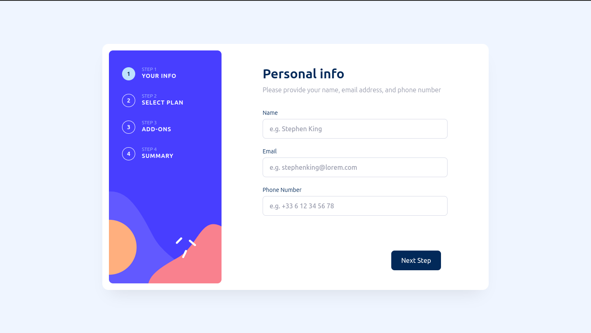

# Frontend Mentor - Multi-step form solution

This is a solution to the [Multi-step form challenge on Frontend Mentor](https://www.frontendmentor.io/challenges/multistep-form-YVAnSdqQBJ). Frontend Mentor challenges help you improve your coding skills by building realistic projects.

## Table of contents

-   [Overview](#overview)
    -   [The challenge](#the-challenge)
    -   [Screenshot](#screenshot)
    -   [Links](#links)
-   [My process](#my-process)
    -   [Built with](#built-with)
    -   [What I learned](#what-i-learned)
    -   [Continued development](#continued-development)
-   [Author](#author)

## Overview

### The challenge

Users should be able to:

-   Complete each step of the sequence
-   Go back to a previous step to update their selections
-   See a summary of their selections on the final step and confirm their order
-   View the optimal layout for the interface depending on their device's screen size
-   See hover and focus states for all interactive elements on the page
-   Receive form validation messages if:
    -   A field has been missed
    -   The email address is not formatted correctly
    -   A step is submitted, but no selection has been made

### Screenshot

### Links

-   Solution URL: [Add solution URL here](https://your-solution-url.com)
-   Live Site URL: [Add live site URL here](https://frontendmentor-multistep-form-three.vercel.app/)

## My process

### Built with

-   Semantic HTML5 markup
-   CSS custom properties
-   Flexbox
-   CSS Grid
-   Mobile-first workflow
-   [React](https://reactjs.org/) - JS library
-   [Vite](https://vitejs.dev/) - Bundler
-   [Tailwind CSS](https://tailwindcss.com/) - For styles
-   [React Hook Form](https://react-hook-form.com/) - Form management
-   [Zod](https://zod.dev/) - Data validation

### What I learned

I tried to play with `react-spring` library to handle animations between wizard steps navigation, but it forced me to use absolute positioning for the whole layout, and it was breaking the scroll on small devices, so I went out with a more classic approach using traditional CSS animation, even if it way more drafty.

## Author

-   Website - [My portfolio](https://jasonsavelli.fr)
-   Frontend Mentor - [@newpoki](https://www.frontendmentor.io/profile/newpoki)
